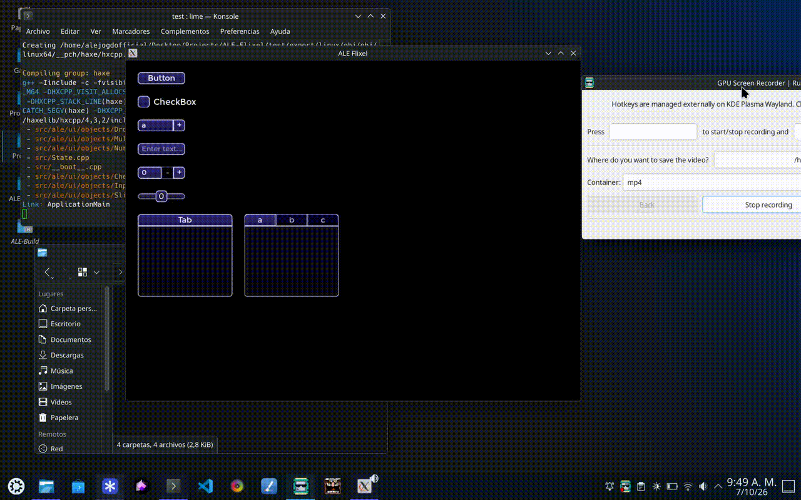

# ALE UI

**ALE UI** is an add-on library that lets you create user interfaces in HaxeFlixel quickly and easily



## Installation

From *haxelib*:
```
haxelib install ale-ui
```

From *git*:
```
haxelib git nxscript https://github.com/ALE-Foundation/ALE-UI.git
```

In your *Project.xml*:
```xml
<haxelib name="ale-ui"/>
```